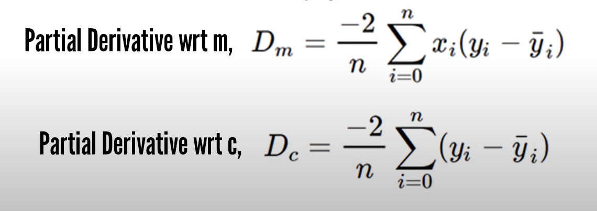

# Machine Learning Assignment-1 README

## Usage

1. **Open your Jupyter notebook**
2. **Import libraries**
    ```python
    import pandas as pd
    import numpy as np
    import matplotlib.pyplot as plt
    ```
3. **Read CSV Files**
    ```python
    # Example: X_data = pd.read_csv('linearX.csv')
    # Example: Y_data = pd.read_csv('linearY.csv')
    ```
4. **Partial Derivative of Cost Function**
    

5. **Use in Model Building**
    ```python
    # Your model building code here
    ```
6. **Standardize Input**
    ```python
    X = (X - X.mean()) / (X.std())
    ```
    ⚠️ **Important:** Standardize your input to prevent explosions!
    
7. **Answer the Following Questions**

## Additional Tips

- Make sure to explore and visualize your data using `matplotlib`.
- Experiment with different algorithms for model building.
- Document your code for better understanding.


